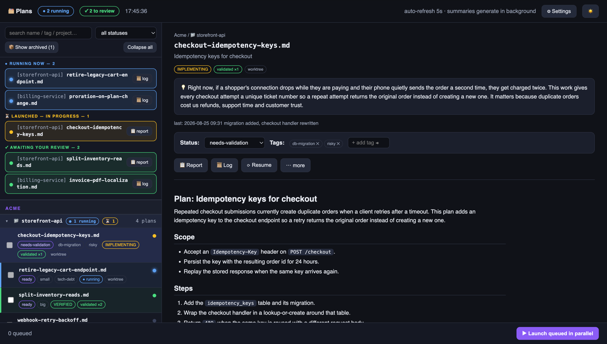
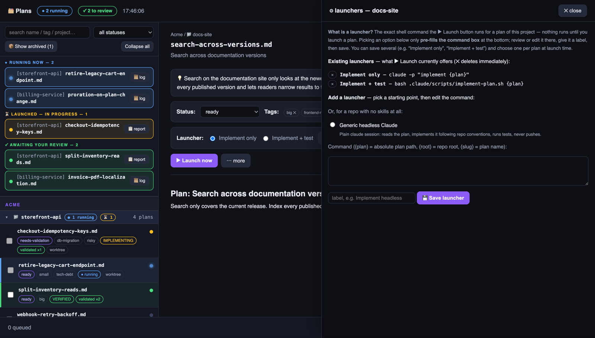

# claude-config

Version-controlled global Claude Code configuration. Symlinked into `~/.claude/`.

## Contents

- `CLAUDE.md` — global standing rules loaded in every project
- `skills/commit-message/` — `/commit-message`: copy-paste Conventional Commits message
- `skills/pr/` — `/pr`: create a PR against a target branch
- `scripts/plans-dashboard.mjs` — local web dashboard for plan files across projects

## Setup on a new machine

```bash
git clone git@github.com:orangeGoran/claude-config.git ~/Workspace/claude-config
cd ~/Workspace/claude-config
ln -sf "$PWD/CLAUDE.md" ~/.claude/CLAUDE.md
mkdir -p ~/.claude/skills
ln -sfn "$PWD/skills/commit-message" ~/.claude/skills/commit-message
ln -sfn "$PWD/skills/pr" ~/.claude/skills/pr
```

Project-level skills with the same name take precedence over these global ones.

## Plans dashboard

A single-file, dependency-free Node server that lists the `*.md` plan files of every
project you register, shows which ones have a run in progress, and launches them.



*Screenshots show a demo project set, not real work.*

### Start it

```bash
node scripts/plans-dashboard.mjs          # → http://127.0.0.1:4899
node scripts/plans-dashboard.mjs --help   # options and file locations
```

It opens empty until you register a project. Requires Node 18+ (developed on 24).

### Add your first project

Open Claude Code **inside the repository you want on the dashboard** and paste this:

```
Register this repository with my plans dashboard.

The dashboard lives at ~/Workspace/claude-config (adjust if I cloned it
elsewhere). Read its README section "Plans dashboard", the header comment of
scripts/plans-dashboard.mjs, and scripts/pipeline-projects.example.json so you
know the registry format.

Then look at THIS repository and work out:

1. Which folder holds its plan files (*.md). Common spots are .plans,
   docs/plans, wiki/plans. If there is no such folder, say so and suggest one
   instead of creating it.
2. Whether .claude/scripts/auto-pipeline.sh exists. If it does, this is a
   "pipeline" project and needs no launcher. If not, it is a "generic" project
   and needs a launcher command.
3. For a generic project, one launcher command that would implement a plan in
   this repo. Base it on what this repo actually has — its .claude/skills, its
   .claude/scripts, its real test and build commands. Use {plan} where the plan
   file path goes.

Show me the proposed registry entry and, in one plain sentence, what the
launcher command would run. Change nothing yet.

Once I approve, MERGE the entry into ~/.claude/pipeline-projects.json, keeping
every project already listed there. Create the file as {"projects": []} first if
it does not exist. Never drop or overwrite an existing entry.
```

Reload the dashboard and the project appears. You can also add projects by hand
(below) or from the dashboard's ⚙ Settings panel.

### The registry

Projects live in `~/.claude/pipeline-projects.json`. Copy
[`scripts/pipeline-projects.example.json`](scripts/pipeline-projects.example.json) as a
starting point. Paths may start with `~`.

| Field | Required | Meaning |
| --- | --- | --- |
| `name` | yes | unique id; letters, digits, `.`, `_`, `-` |
| `root` | yes | repo root |
| `client` | no | grouping header in the sidebar (default `Default`) |
| `plansDir` | no | folder holding the `*.md` plans (default `<root>/.plans`) |
| `doneDir` | no | where archived plans move (default `<plansDir>/done`) |
| `launchers` | no | shell commands the ▶ Launch button can run — see below |

### How a plan gets launched

Two modes, picked automatically per project:

- **Pipeline** — the repo has `.claude/scripts/auto-pipeline.sh`. The dashboard delegates
  to it and reads back its reports, worktrees and lanes. Nothing to configure.
- **Generic** — everything else. You define one or more launcher commands; the dashboard
  runs the chosen one with `bash -lc`, captures its output, and tracks it to completion.
  `{plan}`, `{root}` and `{slug}` are substituted. The ⚙ setup dialog pre-fills commands
  from the repo's own `.claude/skills` and `.claude/scripts`.



Generic run state (pid, exit code, log) lives under `~/.claude/pipeline-dashboard/`.
Statuses and tags are written to `<plansDir>/plan-meta.json` when the repo already tracks
that file, otherwise centrally.

### Running it at login (macOS)

`scripts/launchd/com.plans-dashboard.plist.template` starts the dashboard at login and
restarts it if it crashes. launchd resolves no paths of its own, so fill the template in
and install the result:

```bash
mkdir -p ~/Library/LaunchAgents ~/.claude/pipeline-dashboard
sed -e "s|__NODE__|$(command -v node)|" \
    -e "s|__SCRIPT__|$PWD/scripts/plans-dashboard.mjs|" \
    -e "s|__LOG__|$HOME/.claude/pipeline-dashboard/server.log|" \
    scripts/launchd/com.plans-dashboard.plist.template \
  > ~/Library/LaunchAgents/com.plans-dashboard.plist
launchctl bootstrap gui/$(id -u) ~/Library/LaunchAgents/com.plans-dashboard.plist
```

Remove it with `launchctl bootout gui/$(id -u)/com.plans-dashboard`. Logs go to
`~/.claude/pipeline-dashboard/server.log`.

For a bare hostname with no port suffix, set `DASH_PORT` to `80` in the plist. That claims
port 80 for the whole machine, so skip it if anything else there serves HTTP.

Prefer `http://plans.localhost` — Chrome and Firefox resolve `*.localhost` to loopback with
no `/etc/hosts` entry, and they treat it as a secure context, so browser APIs that require
one (clipboard, notifications) work. A vanity domain such as `plans.test` needs a hosts
entry *and* is not a secure context; the dashboard falls back to a legacy copy path there,
but `plans.localhost` is the smoother option. Safari resolves neither automatically — add
`127.0.0.1 plans.localhost` to `/etc/hosts` if you use it.

### Environment

| Variable | Effect |
| --- | --- |
| `DASH_PORT` | port to listen on (default `4899`) |
| `DASH_NO_OPEN=1` | do not open a browser at startup |
| `DASH_NO_SUMMARY=1` | do not generate plain-language plan summaries |

Summaries are produced by calling the `claude` CLI, which **sends plan text to the
Anthropic API**. Set `DASH_NO_SUMMARY=1` for repos whose contents must not leave the machine.

### Exposure

The server refuses connections that do not come from the loopback interface, but it has no
authentication and no cross-origin checks, and its API can run shell commands. Treat it as
trusted-machine-only software.

### Tests

```bash
node --test 'scripts/test/*.test.mjs'
```

They run against a throwaway `HOME` and a throwaway repo — the real registry is untouched.

## License

[MIT](LICENSE)
